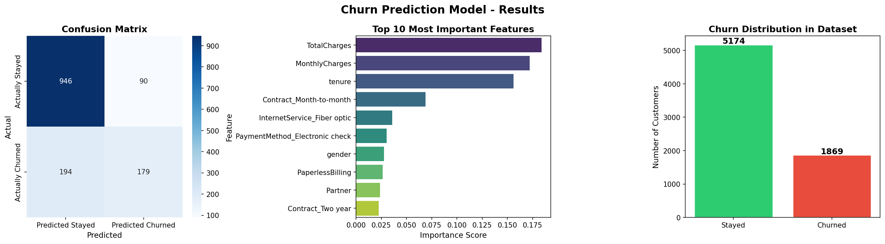

# 🔮 Customer Churn Prediction Model

> Predicting which telecom customers are likely to cancel their service using Machine Learning


---

## 📌 Project Overview

This project predicts customer churn using the IBM Telco Customer Churn dataset.
The goal was to identify customers likely to leave based on their service usage,
billing behavior, and contract type.

I built a Random Forest classification model using Scikit-learn and evaluated
it using accuracy, precision, recall and F1-score metrics.

---

## 📊 Results



| Metric | Score |
|--------|-------|
| ✅ Accuracy | **79.84%** |
| 🎯 Precision (Stayed) | 83% |
| 🎯 Precision (Churned) | 67% |
| 📋 F1 Score | 79% |
| 👥 Customers Analyzed | 7,043 |
| 🌲 Algorithm | Random Forest |

---

## 🔍 Key Findings

- 💰 **TotalCharges** is the #1 predictor of churn — higher lifetime value = more loyal
- 📅 **Month-to-month contract** customers churn at a much higher rate than annual customers
- 💳 Customers paying via **electronic check** show significantly higher churn rates
- 📶 **Fiber optic** internet users churn more than DSL users — likely due to pricing
- 🕐 **New customers** (low tenure) are the highest risk group

---

## 🗂 Dataset

- **Source:** IBM Telco Customer Churn Dataset
- **Size:** 7,043 customers × 21 features
- **Target:** Churn (Yes/No)
- **Class Distribution:** 73.5% Stayed / 26.5% Churned

---

## 🛠 Tech Stack

| Tool | Purpose |
|------|---------|
| Python 3.11 | Core language |
| Pandas | Data manipulation |
| NumPy | Numerical operations |
| Scikit-learn | ML model training |
| Matplotlib | Visualizations |
| Seaborn | Statistical charts |

---
## 📁 Project Structure

```
churn-prediction/
│
├── churn_model.py       # Main ML pipeline
├── churn_results.png    # Model performance charts
├── README.md            # Project documentation
└── .gitignore           # Git ignore rules
```


## 🚀 How to Run

```bash
git clone https://github.com/madhur8600/churn-prediction.git
cd churn-prediction
python3 -m venv venv
source venv/bin/activate
pip install pandas numpy scikit-learn matplotlib seaborn
python3 churn_model.py
```


## 🧠 What I Learned

- Understood how to handle real-world messy data (TotalCharges stored as text)
- Learned why class imbalance affects model performance differently for each class
- Practiced feature encoding — converting Yes/No columns and multi-class columns
- Understood the difference between accuracy, precision and recall in practice

---

*Built from scratch as part of my AI/ML portfolio development*